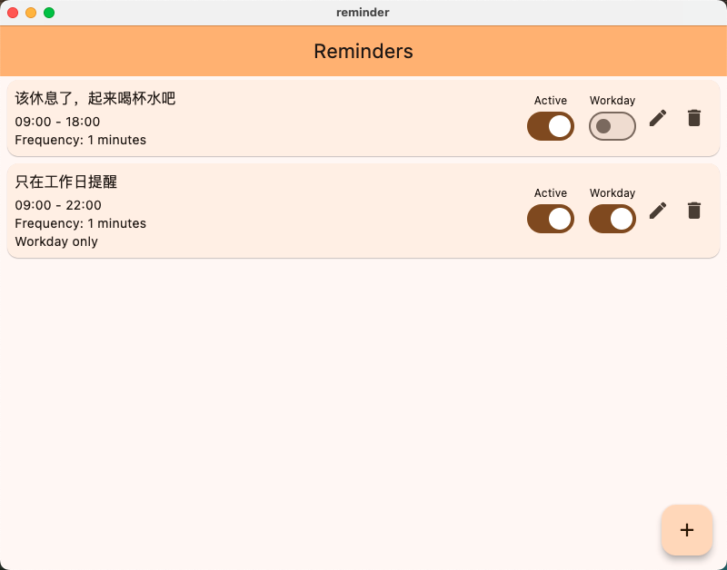

# Reminder，一只独特实用的提醒APP

## 开发背景
  - 市面上的提醒APP无法实现：一旦设置提醒，就会按照频率一直提示，不管是晚上还是周末，造成干扰。来回开关闭，比较繁琐

## 实现目标
- 定义仅在时间范围内（工作日、工作日工作时间内）的事件提醒

## 应用场景
- 1，办公室久坐岗位，繁忙的工作可能忘记站起来休息。可设置工作时间内，每小时提醒我站起来休息，下班后或周末不要提醒我！

## 功能
- [x] 设置是否仅工作日提醒
- [x] 设置每天提醒的时间范围 
- [x] 提醒事项列表
- [x] 提醒事项详情
 

## 效果图
- 事件提醒效果

- 事件列表
 
- 事件编辑


- 设置起始结束时间  


## 使用方法
- 使用Flutter跨平台方案构建，支持Windows,MacOS,Linux平台，根据自己需要编译构建。
- 当前只在MacOS上测试有效，其它平台请自行构建测试
- 欢迎提交贡献，共同维护

## 编译构建
```
# 以下是macos构建指令。其它平台参照文档编译：https://docs.flutter.dev/deployment
flutter build macos
```
