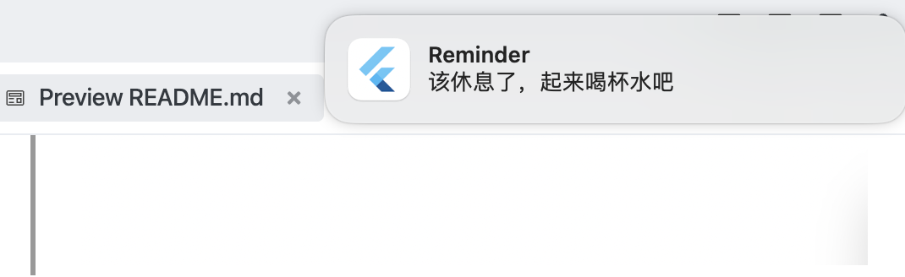
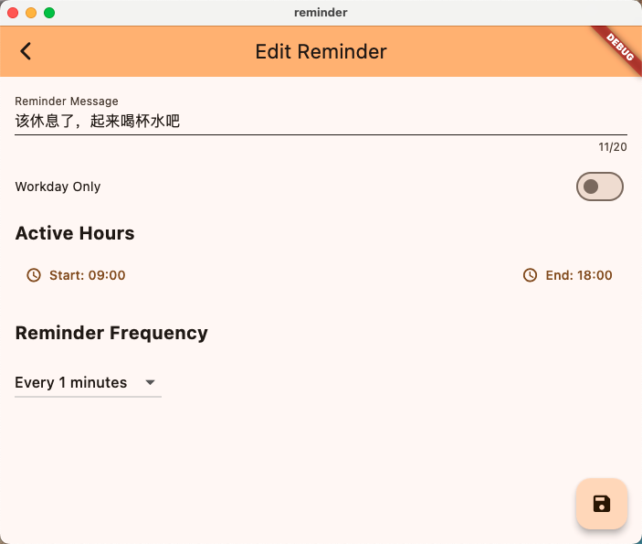
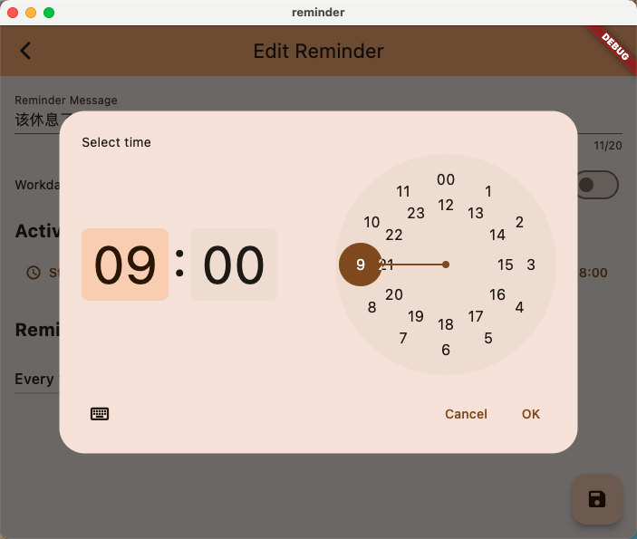

# reminder,一只独特的提醒APP

## 开发背景
  - 市面上的提醒APP无法实现：一旦设置提醒，就会按照频率一直提示，不管是晚上还是周末，除非关闭！
  - 比如：办公室久坐岗位，只需要在白天工作时间内，每小时提醒我站起来喝水，下班后或周末不要提醒我！


## 功能
- [x] 设置是否仅工作日提醒
- [x] 设置每天提醒的时间范围 
- [x] 提醒事项列表
- [x] 提醒事项详情
 

## 效果图
- 事件提醒效果


- 事件编辑    


- 设置起始结束时间  



## 编译
编译到平台的App 
```
# 参照文档编译：https://docs.flutter.dev/deployment/macos
platform可选值 [macos/windows/linux]
flutter build {platform}
```
